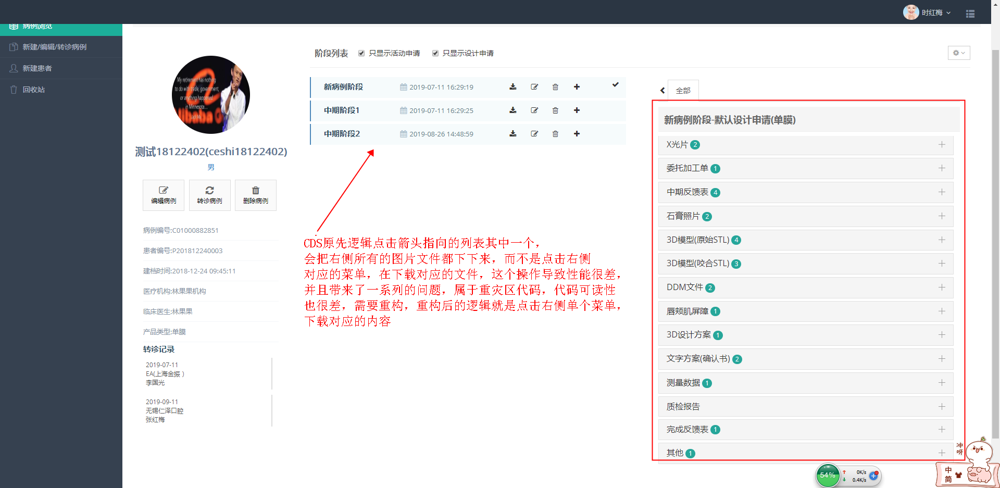
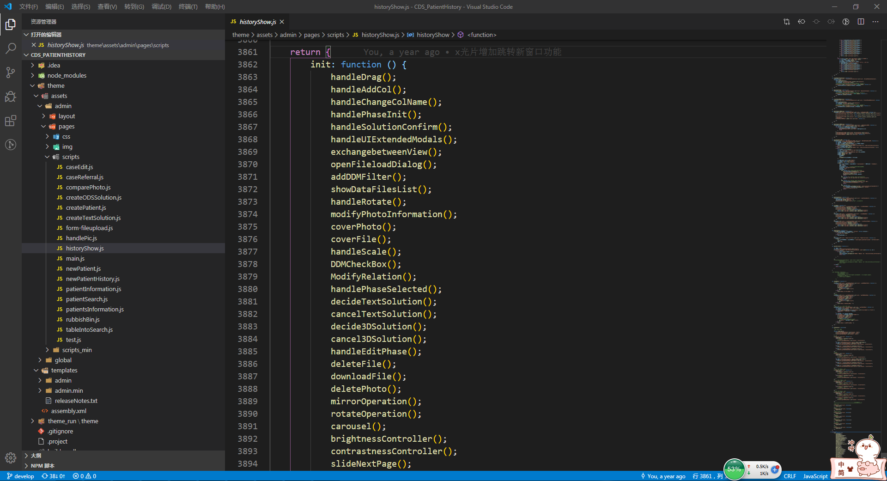
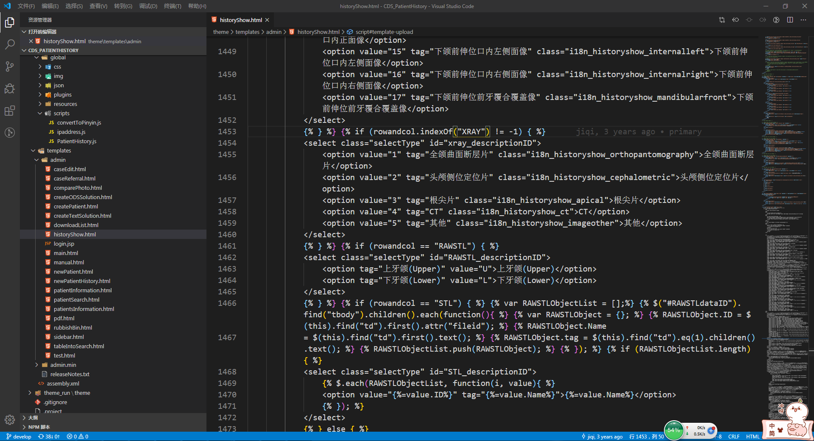
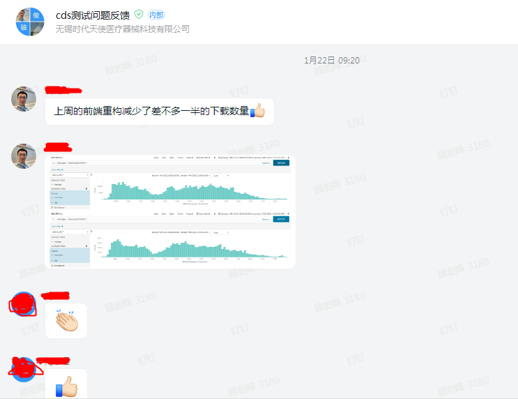
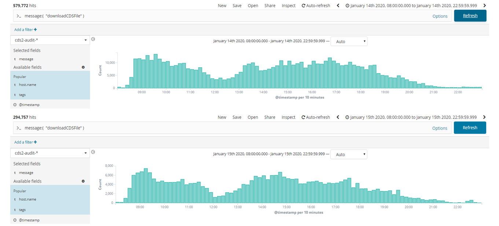
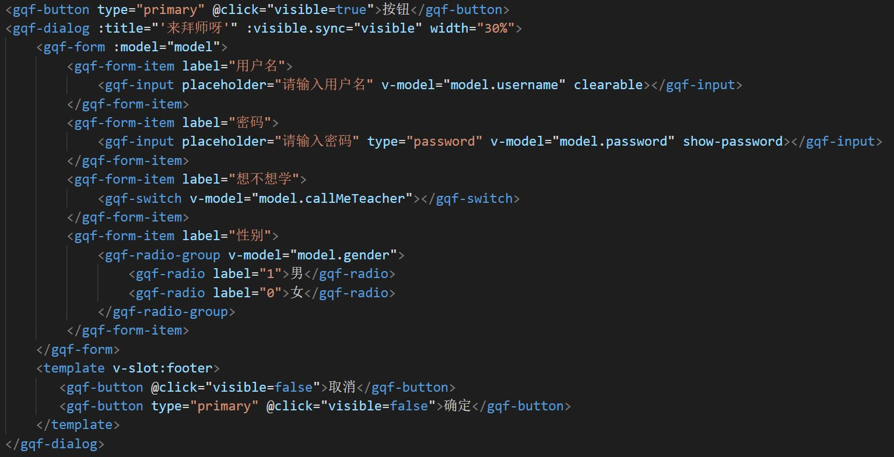
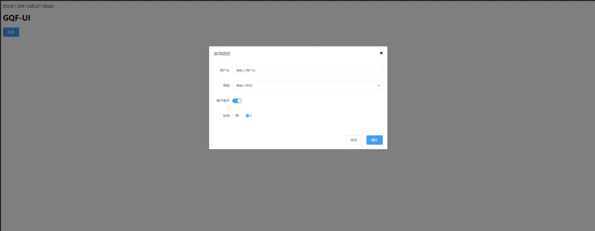
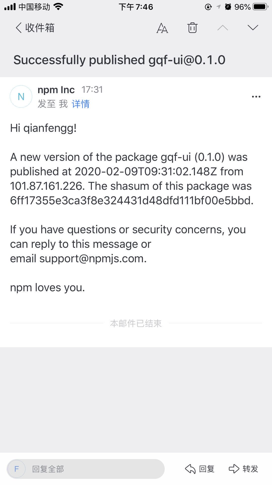

---

# 联系方式
- 手机：13524853180
- Email：fred_gqf0221@163.com
- QQ/微信号：847523167/13524853180

---

# 个人信息

 - 顾乾峰/男/1992 
 - 本科
 - 工作年限：6年 (2014-2017-后端java / 2017-至今-前端)
 - Github：http://github.com/qianfengg

 - 期望职位：Web前端高级程序员/js全栈
 - 期望薪资：税前月薪20k~22k
 - 期望城市：上海

---

# 工作经历

## 时代天使 （ 2017年12月 ~ 至今 ）

### CDS项目 （此项目为最近参与的项目，主要重构为主）

1. 项目描述

    1. 一个关于患者病例的系统，其中有查看方案，修改方案，查看照片等功能 
    2. 技术架构 - 项目比较老，大量原生的代码与jq混写及页面各种老的模板语法类似jsp，ejs

2. 项目职责及目标

    1. 提高页面性能
    2. 提高代码可读性，维护性
    3. 使用vue替代之前的老模板，使代码维护性可读性更高
    4. 通过重构，项目性能提高一倍

3. 部分截图参考

    1. 重灾区功能，重构的原因

        

    2. **重构前**老项目的代码如下

        

        

    3. **重构后**数据说明一切   

         

         

### MES项目 （开发功能）

1. 项目描述

    1. 无锡工厂生产过程执行管理系统
    2. 技术架构 - angular1 + layui 

2. 项目职责

    1. 静态页布局，使用layui布局，精确完成设计稿。
    2. 采用ng1开发，完成前端的页面交互。
    3. 前后端交互采用ng1中的$http
    4. 熟悉ng1的directive绑定策略
    5. 熟悉ng1的数据绑定，通过scope,ng-model实现双绑

### ERP项目 （开发功能）

1. 项目描述

    1. 企业信息管理系统
    2. 技术架构 - jq + bootstrap 

2. 项目职责

    1. 使用Bootstrap布局，快速搭建页面。
    2. 添加页面交互插件，如分页，日期选择器等。
    3. 根据后台接口文档，使用Ajax完成数据交互。
    4. 测试阶段排查错误，定位问题，解决bug。
    5. 后续版本跟新，需求变化。持续支持

## 贝格大数据

后端具体经历就不具体写了，个人目标是高级前端工程师或者js全栈

## 吉贝克

同上

---

# 开源项目和作品

## 开源项目

* [GQF-UI](https://github.com/qianfengg/gqf-ui)

    * 参考element-ui，基于vue简单实现了部分组件，在github开源并且发布到npm 
    * 部分截图参考

        

        

        

## 技术文章

- [cocos微信小游戏](https://github.com/qianfengg/Wechat-Game-Training)
- [记录node学习的过程](https://github.com/qianfengg/NODE)
- [记录vue学习的过程](https://github.com/qianfengg/Vue-Learning)

## 演讲和讲义

- 技术中心内部分享-[Canvas开发](./Canvas/Canvas.md)
- 技术中心内部分享-es6相关知识(根据上次canvas开发的小例子及[阮一峰es6入门](http://es6.ruanyifeng.com/)教程讲解，没有相关的讲义)
- 技术中心内部分享-[数学与编程](./数学与编程/数学与编程.md)

# 技能清单

1. 熟悉W3C标准能解决浏览器之间的兼容。
2. 熟悉CSS3最新样式，实现动画效果。掌握弹性布局。
3. 熟练原生JS，dom操作，掌握面向对象机制，理解原型链的继承机制。
4. 熟悉Vue，React框架。
5. 熟悉webpack，了解具体webpack入口，出口配置，能够完成常见loader,插件的配置。
6. 熟练运用Ajax完成数据交互。
7. 熟练ES6
8. 熟悉数据库相关：MySQL/Mongo
9. 熟悉版本管理：文档和自动化部署工具：Svn/Git

---

# 致谢
感谢您花时间阅读我的简历，期待能有机会和您共事。
